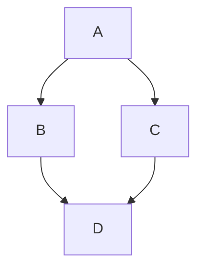

Note: Use Markdown Cheat Sheet download in the directory as needed.

- Useful links
  - https://github.com/im-luka/markdown-cheatsheet

---
## Date: Week 1 - September 1, 2026
- Topics of discussion
    - Team formed: Nikhil, Siddu, Venkatesh, Viharika
    - First proposals (LongAgent Bench, SpecComp Bench) submitted as petitions
    - Advisor feedback: proposals too easy for four people over one semester

- Action Items:

* [x] Submit petition proposals
* [x] Collect advisor feedback
* [x] Search for a harder project on transformer internals
---

## Date: Week 2 - September 8, 2026
- Topics of discussion
    - Considered SAE Faithful (proposal 7), already taken by another group
    - Settled on WM Concord: do four world model diagnostics agree?
    - Proposal written and submitted as proposal 10

- Action Items:

* [x] Write and submit WM Concord proposal
* [x] Pick the four diagnostics (D1 to D4) and hypotheses (H1 to H4)
* [x] Collect core papers (Li 2023, Vafa 2024, Vafa 2025, Yuan and Sogaard 2025)
---
## Date: Week 3 - September 15, 2026
- Topics of discussion
    - Repository created with the required folder template and main branch ruleset
    - AWS g5.2xlarge access and environment setup
    - Project board, first milestone, and first issues created

- Action Items:

* [x] Create repo, ruleset, milestone, and project board
* [x] Pin requirements.txt on the A10G instance (PR #3)
* [x] Literature notes for 4 core papers (PR #10, closes #1)
* [ ] Draft run_matrix.csv (#4)
* [ ] Download Othello and Vafa 2024 artifacts (#2)
---
## Date: Week 4 - September 22, 2026
- Topics of discussion
    - Instructor Review #1 (#5): no code yet, about 3 weeks behind, two members without commits
    - New requirements: vector figures only, draw.io or SVG diagrams, LaTeX report with 10+ cited works by October 6
    - Plan: Othello first, with diagnostic D4 (linear probe) end to end before the October 20 presentation

- Action Items:

* [x] Give instructor Write access to the project board
* [x] Re date Week 3 milestone, add Preliminary and Final milestones
* [x] One owner per issue
* [x] Merge requirements.txt and references.bib
* [x] Move proposal to reports/proposal.md, rewrite README
* [ ] Start LaTeX report skeleton with literature review section
* [ ] Add pytest and a GitHub Action
* [ ] Every team member lands at least one reviewed pull request this week
* [ ] Othello model zoo and D4 probe running end to end on the g5.2xlarge
---
## Date: Week 5 - Month Day Year 
- Topics of discussion
    - Item1
    - Item2
    - Item3

- Action Items:

* [ ] Action Item 1
* [ ] Action Item 2
* [ ] Action Item 3
* [ ] Action Item 4
* [ ] Action Item 5
---
## Date: Week 6 - Month Day Year 
- Topics of discussion
    - Item1
    - Item2
    - Item3

- Action Items:

* [ ] Action Item 1
* [ ] Action Item 2
* [ ] Action Item 3
* [ ] Action Item 4
* [ ] Action Item 5
---
## Date: Week 7 - Month Day Year 
- Topics of discussion
    - Item1
    - Item2
    - Item3

- Action Items:

* [ ] Action Item 1
* [ ] Action Item 2
* [ ] Action Item 3
* [ ] Action Item 4
* [ ] Action Item 5
----
## Date: Week 8 - Month Day Year 
- Topics of discussion
    - Item1
    - Item2
    - Item3

- Action Items:

* [ ] Action Item 1
* [ ] Action Item 2
* [ ] Action Item 3
* [ ] Action Item 4
* [ ] Action Item 5
---

## Date: Week 9 - Month Day Year 
- Topics of discussion
    - Item1
    - Item2
    - Item3

- Action Items:

* [ ] Action Item 1
* [ ] Action Item 2
* [ ] Action Item 3
* [ ] Action Item 4
* [ ] Action Item 5
---
## Date: Week 10 - Month Day Year 
- Topics of discussion
    - Item1
    - Item2
    - Item3

- Action Items:

* [ ] Action Item 1
* [ ] Action Item 2
* [ ] Action Item 3
* [ ] Action Item 4
* [ ] Action Item 5
---
## Date: Week 11 - Month Day Year 
- Topics of discussion
    - Item1
    - Item2
    - Item3

- Action Items:

* [ ] Action Item 1
* [ ] Action Item 2
* [ ] Action Item 3
* [ ] Action Item 4
* [ ] Action Item 5
---
## Date: Week 12 - Month Day Year 
- Topics of discussion
    - Item1
    - Item2
    - Item3

- Action Items:

* [ ] Action Item 1
* [ ] Action Item 2
* [ ] Action Item 3
* [ ] Action Item 4
* [ ] Action Item 5
---
## Date: Week 13 - Month Day Year 
- Topics of discussion
    - Item1
    - Item2
    - Item3

- Action Items:

* [ ] Action Item 1
* [ ] Action Item 2
* [ ] Action Item 3
* [ ] Action Item 4
* [ ] Action Item 5
---
## Date: Week 14 - Month Day Year 
- Topics of discussion
    - Item1
    - Item2
    - Item3

- Action Items:

* [ ] Action Item 1
* [ ] Action Item 2
* [ ] Action Item 3
* [ ] Action Item 4
* [ ] Action Item 5
---
- **_Add Images and Diagrams Using Excalidraw_**
  - Just draw it and then copy as png paster in the editor


- **_Add Equation_**
  - $e^{\pi i} + 1 = 0$


- **_Add Pyhton Code_**

```
import numpy as np
a = np.array()
```

- **_Add Tables as needed._**

| Checkbox Experiments | checked header | crossed header |
| ---------------------|:--------------:|:--------------:|
| checkbox             |  &check; Row   |  &cross; row   |


- **_Add Tables as needed._**


|checked|unchecked|crossed|
|---|---|---|
|&check;|_|&cross;|
|&#x2611;|&#x2610;|&#x2612;|


- **_Add Tables as needed._**

| Selection |        |
| --------- | ------ |
| &#x2610;  |

| Selection |        |
| --------- | ------ |
| &#x2611; |

- **_Create Links as needed_**
  - [link text](full url minus the en-us locale)

- **_Add Geo Json_**

```geojson
{
  "type": "FeatureCollection",
  "features": [
    {
      "type": "Feature",
      "id": 1,
      "properties": {
        "ID": 0
      },
      "geometry": {
        "type": "Polygon",
        "coordinates": [
          [
              [-90,35],
              [-90,30],
              [-85,30],
              [-85,35],
              [-90,35]
          ]
        ]
      }
    }
  ]
}
```

- **_Add flow chart_**



