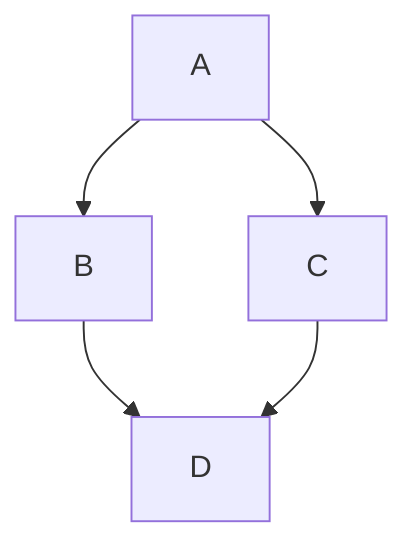

Note: Use Markdown Cheat Sheet download in the directory as needed.

- Useful links
  - https://github.com/im-luka/markdown-cheatsheet

---
## Date: Week 1 - September 1, 2026
- Topics of discussion
    - Team formed: Nikhil, Siddu, Venkatesh, Viharika
    - First proposals (LongAgent Bench, SpecComp Bench) submitted as petitions
    - Advisor feedback: proposals too easy for four people over one semester

- Action Items:

* [x] Submit petition proposals
* [x] Collect advisor feedback
* [x] Search for a harder project on transformer internals
---

## Date: Week 2 - September 8, 2026
- Topics of discussion
    - Considered SAE Faithful (proposal 7), already taken by another group
    - Settled on WM Concord: do four world model diagnostics agree?
    - Proposal written and submitted as proposal 10

- Action Items:

* [x] Write and submit WM Concord proposal
* [x] Pick the four diagnostics (D1 to D4) and hypotheses (H1 to H4)
* [x] Collect core papers (Li 2023, Vafa 2024, Vafa 2025, Yuan and Sogaard 2025)
---
## Date: Week 3 - September 15, 2026
- Topics of discussion
    - Repository created with the required folder template and main branch ruleset
    - AWS g5.2xlarge access and environment setup
    - Project board, first milestone, and first issues created

- Action Items:

* [x] Create repo, ruleset, milestone, and project board
* [x] Pin requirements.txt on the A10G instance (PR #3)
* [x] Literature notes for 4 core papers (PR #10, closes #1)
* [ ] Draft run_matrix.csv (#4)
* [ ] Download Othello and Vafa 2024 artifacts (#2)
---
## Date: Week 4 - September 22, 2026
- Topics of discussion
    - Instructor Review #1 (#5): no code yet, about 3 weeks behind, two members without commits
    - New requirements: vector figures only, draw.io or SVG diagrams, LaTeX report with 10+ cited works by October 6
    - Plan: Othello first, with diagnostic D4 (linear probe) end to end before the October 20 presentation

- Action Items:

* [x] Give instructor Write access to the project board
* [x] Re date Week 3 milestone, add Preliminary and Final milestones
* [x] One owner per issue
* [x] Merge requirements.txt and references.bib
* [x] Move proposal to reports/proposal.md, rewrite README
* [x] Environment built on the g5.2xlarge, Vafa 2024 and Othello artifacts downloaded (#2 closed)
* [x] D1 explainer and diagram (PR #21), D4 explainer, diagram and toy probe (PR #16, PR #18)
* [x] D3 toy probe and diagram opened for review (PR #23)
* [x] Run matrix fixed at 3 domains, 243 models, 972 runs (PR #19, in review)
* [x] Week 3 milestone closed
* [ ] Start LaTeX report skeleton with literature review section (moved to Week 5)
* [ ] Add pytest and a GitHub Action (moved to Week 5)
* [ ] Every team member lands at least one reviewed pull request this week (3 of 4)
* [ ] Othello model zoo and D4 probe running end to end on the g5.2xlarge (moved to Week 5)
---
## Date: Week 5 - September 29, 2026
- Topics of discussion
    - Instructor Review #2 (#22): process caught up, still about 3 weeks behind the plan
    - Top priority: reproduction gate, one published number reproduced before building on it
    - Scope fixed in the proposal: 3 domains (navigation, Othello, interpreter), 15 weeks

- Action Items:

* [x] Diagram naming standard, one bib file, proposal fit to 15 weeks and 3 domains (PR #25, closes #24)
* [x] Reproduction gate: Othello GPT linear probe within 1 point of Nanda et al. 2023 on 5 of 6 values (PR #31)
* [x] Throughput measured for all 3 architectures and 3 scales, Mamba via mambapy (PR #19)
* [x] D4 toy probe: Hewitt and Liang control task, layer 0 baseline, Othello rules test (PR #29)
* [x] LaTeX report skeleton in Sample_Report.tex (PR #36)
* [x] pytest and a GitHub Action (PR #33)
* [x] Shared Othello domain module (PR #38) and three Othello distributions with WTHOR championship games (PR #40)
* [ ] D2 explainer (#7) (moved to Week 6)
* [ ] Literature review with 10+ works, 4 of 10 written (moved to Week 6, due October 6)
---
## Date: Week 6 - October 6, 2026
- Topics of discussion
    - Instructor Review #3 (#41): about 2 weeks behind (was 3), trend up; reproduction gate accepted
    - Scope decision written down before any model is scored: full 243 model matrix with Mamba large, Othello first (81 models, D1 and D4 by October 20), navigation and the interpreter after October 20, interpreter held out for H4, no architecture held out (PR #47)
    - Fragility suite v1 for Othello: rules kept fixed, situations shifted; frozen with tag fragility-v1 before any scoring (PR #43)

- Action Items:

* [ ] Literature review to 10+ works and 6 new references.bib entries
* [ ] First zoo models: one transformer, LSTM and Mamba on synthetic Othello with legal move rate (PR #47)
* [ ] Freeze and tag the fragility suite (PR #43)
* [ ] Results schema, common diagnostic interface, model registry, activation hooks for all 3 architectures
* [ ] Preregistration of the H1 to H4 analysis
* [ ] Othello zoo training split across the 4 instances
* [ ] Occupancy only baseline for the black/white probe
* [ ] D2 explainer (#7)
---
## Date: Week 7 - Month Day Year 
- Topics of discussion
    - Item1
    - Item2
    - Item3

- Action Items:

* [ ] Action Item 1
* [ ] Action Item 2
* [ ] Action Item 3
* [ ] Action Item 4
* [ ] Action Item 5
----
## Date: Week 8 - Month Day Year 
- Topics of discussion
    - Item1
    - Item2
    - Item3

- Action Items:

* [ ] Action Item 1
* [ ] Action Item 2
* [ ] Action Item 3
* [ ] Action Item 4
* [ ] Action Item 5
---

## Date: Week 9 - Month Day Year 
- Topics of discussion
    - Item1
    - Item2
    - Item3

- Action Items:

* [ ] Action Item 1
* [ ] Action Item 2
* [ ] Action Item 3
* [ ] Action Item 4
* [ ] Action Item 5
---
## Date: Week 10 - Month Day Year 
- Topics of discussion
    - Item1
    - Item2
    - Item3

- Action Items:

* [ ] Action Item 1
* [ ] Action Item 2
* [ ] Action Item 3
* [ ] Action Item 4
* [ ] Action Item 5
---
## Date: Week 11 - Month Day Year 
- Topics of discussion
    - Item1
    - Item2
    - Item3

- Action Items:

* [ ] Action Item 1
* [ ] Action Item 2
* [ ] Action Item 3
* [ ] Action Item 4
* [ ] Action Item 5
---
## Date: Week 12 - Month Day Year 
- Topics of discussion
    - Item1
    - Item2
    - Item3

- Action Items:

* [ ] Action Item 1
* [ ] Action Item 2
* [ ] Action Item 3
* [ ] Action Item 4
* [ ] Action Item 5
---
## Date: Week 13 - Month Day Year 
- Topics of discussion
    - Item1
    - Item2
    - Item3

- Action Items:

* [ ] Action Item 1
* [ ] Action Item 2
* [ ] Action Item 3
* [ ] Action Item 4
* [ ] Action Item 5
---
## Date: Week 14 - Month Day Year 
- Topics of discussion
    - Item1
    - Item2
    - Item3

- Action Items:

* [ ] Action Item 1
* [ ] Action Item 2
* [ ] Action Item 3
* [ ] Action Item 4
* [ ] Action Item 5
---
- **_Add Images and Diagrams Using Excalidraw_**
  - Just draw it and then copy as png paster in the editor


- **_Add Equation_**
  - $e^{\pi i} + 1 = 0$


- **_Add Pyhton Code_**

```
import numpy as np
a = np.array()
```

- **_Add Tables as needed._**

| Checkbox Experiments | checked header | crossed header |
| ---------------------|:--------------:|:--------------:|
| checkbox             |  &check; Row   |  &cross; row   |


- **_Add Tables as needed._**


|checked|unchecked|crossed|
|---|---|---|
|&check;|_|&cross;|
|&#x2611;|&#x2610;|&#x2612;|


- **_Add Tables as needed._**

| Selection |        |
| --------- | ------ |
| &#x2610;  |

| Selection |        |
| --------- | ------ |
| &#x2611; |

- **_Create Links as needed_**
  - [link text](full url minus the en-us locale)

- **_Add Geo Json_**

```geojson
{
  "type": "FeatureCollection",
  "features": [
    {
      "type": "Feature",
      "id": 1,
      "properties": {
        "ID": 0
      },
      "geometry": {
        "type": "Polygon",
        "coordinates": [
          [
              [-90,35],
              [-90,30],
              [-85,30],
              [-85,35],
              [-90,35]
          ]
        ]
      }
    }
  ]
}
```

- **_Add flow chart_**



```mermaid
graph TD;
    A-->B;
    A-->C;
    B-->D;
    C-->D;
```
